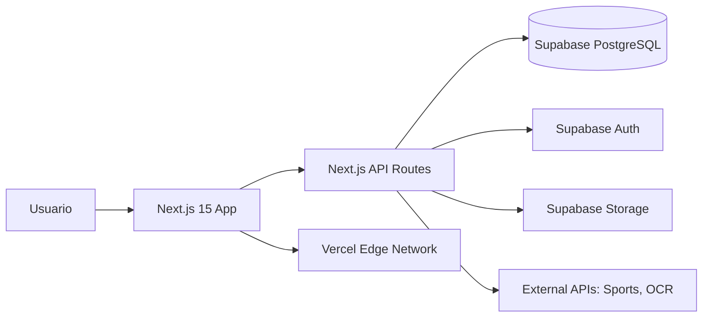
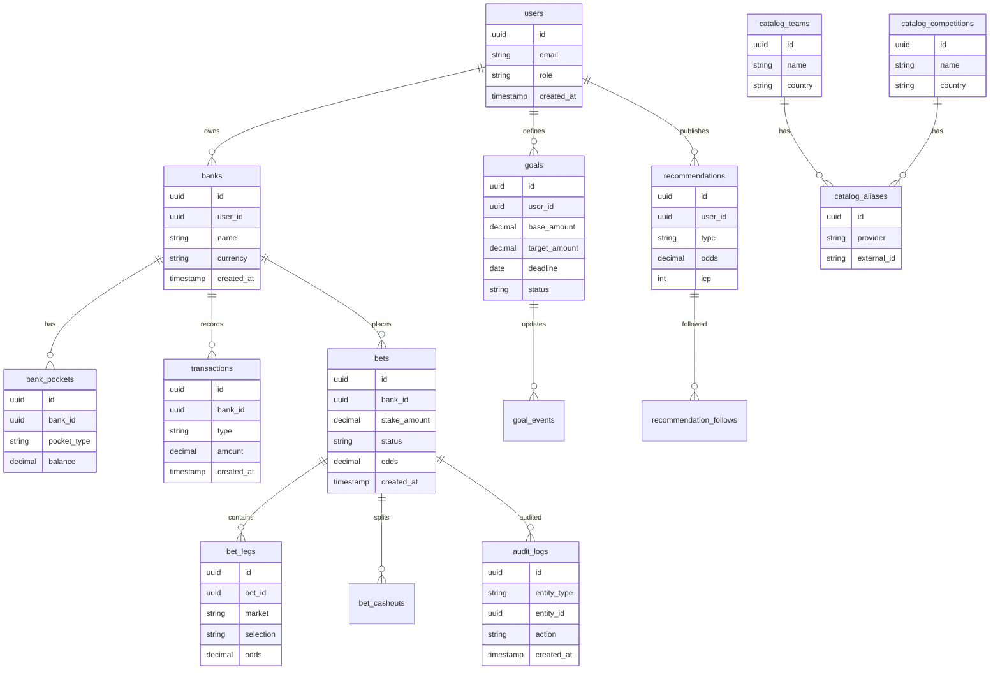
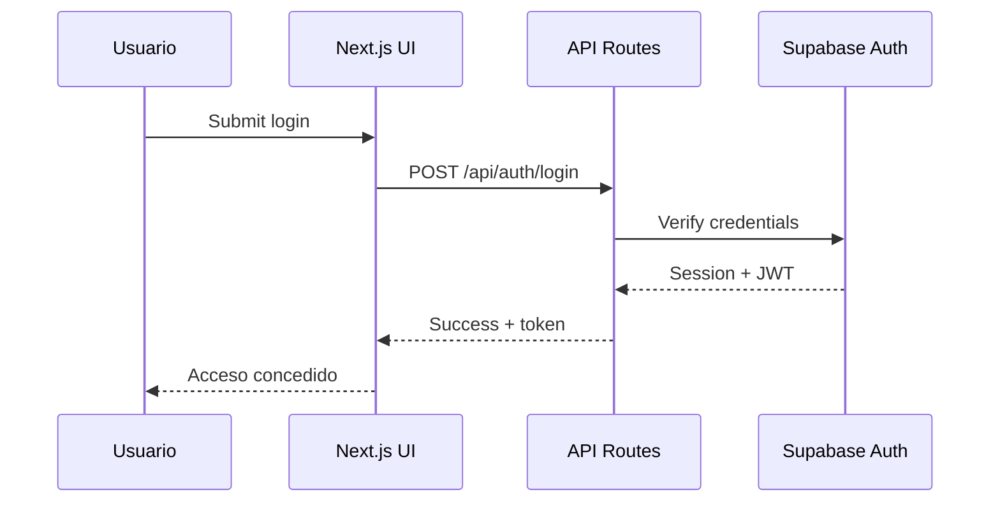

# Architecture Specs - StakeLedger

**Fecha:** 2026-02-28
**Version:** 1.0
**Autor:** Equipo StakeLedger

---

## 1. System Architecture (C4 Level 1-2)

---

## 2. Database Design (ERD)

> Nota: El schema final se obtiene via Supabase MCP. No se hardcodea SQL en esta fase.

---

## 3. Tech Stack Justification

- **Frontend: Next.js 15 (App Router)**
  - ✅ React Server Components para performance
  - ✅ Routing file-based y full-stack en un solo repo
  - ✅ Integracion nativa con Vercel
  - ❌ Curva de aprendizaje del App Router

- **Backend: Next.js API Routes**
  - ✅ Simplifica despliegue y DX
  - ✅ Permite endpoints cerca del dominio
  - ✅ Integracion directa con Supabase
  - ❌ Menos flexible que un backend dedicado en alto trafico

- **Database/Auth: Supabase (PostgreSQL)**
  - ✅ RLS y Auth integrados
  - ✅ Buen soporte para real-time y storage
  - ✅ SQL estandar y extensible
  - ❌ Dependencia de proveedor

- **Hosting: Vercel**
  - ✅ CDN global y edge caching
  - ✅ CI/CD simple
  - ✅ Excelente soporte para Next.js
  - ❌ Costos pueden escalar con trafico

- **CI/CD: GitHub Actions**
  - ✅ Integracion con repo y PRs
  - ✅ Automatizacion de tests y lint
  - ✅ Gratis para MVP
  - ❌ Limites de minutos en planes basicos

---

## 4. Data Flow (Create Bet Ticket)

1. User completa formulario de apuesta (Frontend)
2. Validacion client-side (schema)
3. POST /api/bets
4. Validacion server-side
5. Calculo de stake y cap 40% cash
6. Insert en bets y bet_legs
7. Registro en transactions y audit_logs
8. Respuesta 201 con bet_id y saldos actualizados
9. UI actualiza ledger y balance

---

## 5. Security Architecture

### Auth Flow Diagram

### RBAC Implementation

- Roles definidos: admin, editor, user
- Policies en API Routes y RLS en Supabase
- Endpoints admin solo accesibles por admin/editor

### Data Protection

- TLS 1.3 en trafico
- Encryption at rest via Supabase
- Validacion estricta de inputs
- Logs de auditoria para cambios criticos
