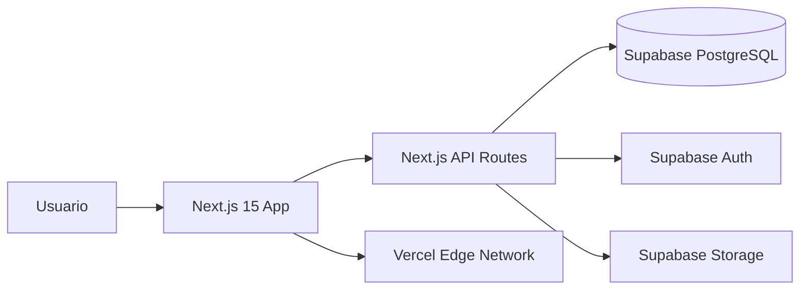
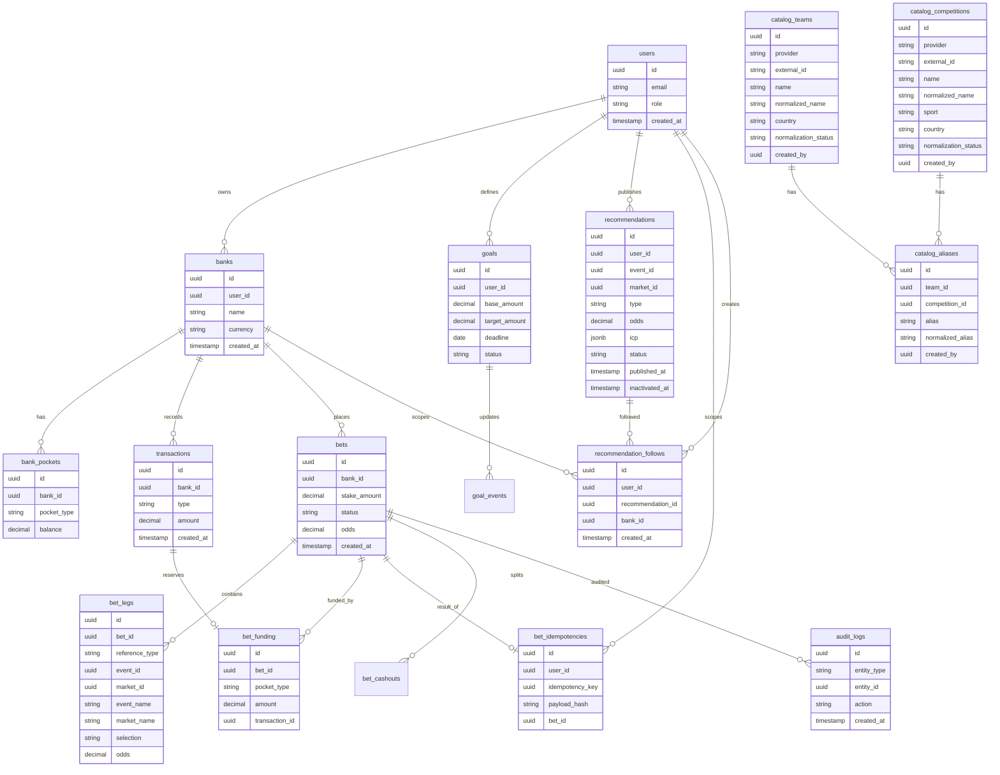
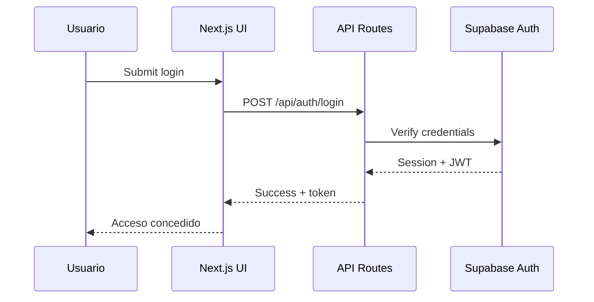

# Architecture Specs - StakeLedger

**Fecha:** 2026-08-17
**Version:** 1.1
**Autor:** Equipo StakeLedger

---

## 1. System Architecture (C4 Level 1-2)

```mermaid
flowchart LR
  user[Usuario] --> ui[Next.js 15 App]
  ui --> api[Next.js API Routes]
  api --> db[(Supabase PostgreSQL)]
  api --> auth[Supabase Auth]
  api --> storage[Supabase Storage]
  ui --> cdn[Vercel Edge Network]
```

---

## 2. Database Design (ERD)

> Nota: El schema final se obtiene via Supabase MCP. No se hardcodea SQL en esta fase.

```mermaid
erDiagram
  users ||--o{ banks : owns
  users ||--o{ goals : defines
  users ||--o{ recommendations : publishes
  banks ||--o{ bank_pockets : has
  banks ||--o{ transactions : records
  banks ||--o{ bets : places
  bets ||--o{ bet_legs : contains
  bets ||--o{ bet_funding : funded_by
  transactions ||--o| bet_funding : reserves
  users ||--o{ bet_idempotencies : scopes
  bets ||--o| bet_idempotencies : result_of
  bets ||--o{ bet_cashouts : splits
  bets ||--o{ audit_logs : audited
  goals ||--o{ goal_events : updates
  users ||--o{ recommendation_follows : creates
  banks ||--o{ recommendation_follows : scopes
  recommendations ||--o{ recommendation_follows : followed
  catalog_teams ||--o{ catalog_aliases : has
  catalog_competitions ||--o{ catalog_aliases : has

  users {
    uuid id
    string email
    string role
    timestamp created_at
  }
  banks {
    uuid id
    uuid user_id
    string name
    string currency
    timestamp created_at
  }
  bank_pockets {
    uuid id
    uuid bank_id
    string pocket_type
    decimal balance
  }
  transactions {
    uuid id
    uuid bank_id
    string type
    decimal amount
    timestamp created_at
  }
  bets {
    uuid id
    uuid bank_id
    decimal stake_amount
    string status
    decimal odds
    timestamp created_at
  }
  bet_legs {
    uuid id
    uuid bet_id
    string reference_type
    uuid event_id
    uuid market_id
    string event_name
    string market_name
    string selection
    decimal odds
  }
  bet_funding {
    uuid id
    uuid bet_id
    string pocket_type
    decimal amount
    uuid transaction_id
  }
  bet_idempotencies {
    uuid id
    uuid user_id
    uuid idempotency_key
    string payload_hash
    uuid bet_id
  }
  goals {
    uuid id
    uuid user_id
    decimal base_amount
    decimal target_amount
    date deadline
    string status
  }
  recommendations {
    uuid id
    uuid user_id
    uuid event_id
    uuid market_id
    string type
    decimal odds
    jsonb icp
    string status
    timestamp published_at
    timestamp inactivated_at
  }
  recommendation_follows {
    uuid id
    uuid user_id
    uuid recommendation_id
    uuid bank_id
    timestamp created_at
  }
  catalog_teams {
    uuid id
    string provider
    string external_id
    string name
    string normalized_name
    string country
    string normalization_status
    uuid created_by
  }
  catalog_competitions {
    uuid id
    string provider
    string external_id
    string name
    string normalized_name
    string sport
    string country
    string normalization_status
    uuid created_by
  }
  catalog_aliases {
    uuid id
    uuid team_id
    uuid competition_id
    string alias
    string normalized_alias
    uuid created_by
  }
  audit_logs {
    uuid id
    string entity_type
    uuid entity_id
    string action
    timestamp created_at
  }
```

Fase 4J no integra providers deportivos, scraping ni OCR. Catálogo permanece local y curado; cualquier integración externa es posterior al MVP.

`catalog_competitions.sport` es obligatorio para entidades normalizadas y nullable únicamente para entradas con `normalization_status='manual'`.

---

## 3. Tech Stack Justification

- **Frontend: Next.js 15 (App Router)**
  - ✅ React Server Components para performance
  - ✅ Routing file-based y full-stack en un solo repo
  - ✅ Integracion nativa con Vercel
  - ❌ Curva de aprendizaje del App Router

- **Backend: Next.js API Routes**
  - ✅ Simplifica despliegue y DX
  - ✅ Permite endpoints cerca del dominio
  - ✅ Integracion directa con Supabase
  - ❌ Menos flexible que un backend dedicado en alto trafico

- **Database/Auth: Supabase (PostgreSQL)**
  - ✅ RLS y Auth integrados
  - ✅ Buen soporte para real-time y storage
  - ✅ SQL estandar y extensible
  - ❌ Dependencia de proveedor

- **Hosting: Vercel**
  - ✅ CDN global y edge caching
  - ✅ CI/CD simple
  - ✅ Excelente soporte para Next.js
  - ❌ Costos pueden escalar con trafico

- **CI/CD: GitHub Actions**
  - ✅ Integracion con repo y PRs
  - ✅ Automatizacion de tests y lint
  - ✅ Gratis para MVP
  - ❌ Limites de minutos en planes basicos

---

## 4. Data Flow (Create Bet Ticket)

> Implementación Fase 4G aplicada para SL-12/SL-13. No describe settlement ni cashout.

1. Usuario completa `/dashboard/bets/new` con ticket, 1..20 legs, stake y funding.
2. UI valida para feedback, sin asumir autoridad sobre saldos o cap.
3. BFF recibe `POST /api/bets` con cookie de sesión e `Idempotency-Key` UUID.
4. BFF valida payload discriminado: stake por amount/level y legs normalized/manual.
5. Cliente `service_role` invoca una RPC `SECURITY INVOKER` no ejecutable por `anon` ni `authenticated`.
6. RPC bloquea idempotencia, bank y pockets en orden determinista.
7. RPC lee cash previo, calcula stake con `cash × (level/20) × 0.40` cuando aplica y valida cap exacto del 40%.
8. RPC crea ticket, legs, funding y una transacción `bet_reserve` por cada aporte positivo.
9. Cada `bet_funding` enlaza su reserva; el ticket cambia a `open` únicamente al completar todas.
10. Cualquier fallo revierte agregado, saldos e idempotencia.
11. API responde `201` al crear o `200` ante replay equivalente; la UI actualiza ticket y balances.

### Preflight completado Fase 4G

- Migration RBAC local y remota reconciliada como `20260816145742_add_admin_role_management.sql`.
- Las 4 bets legacy remotas se preservan sin borrado ni backfill; constraints Fase 4G se aplican a filas nuevas sin validar retrospectivamente su forma.

## 4H. Data Flow (Settlement, Cashout and Audit)

1. BFF autentica cookie y exige `Idempotency-Key` UUID.
2. Cliente `service_role` invoca RPC `SECURITY INVOKER`; `authenticated` no tiene `EXECUTE` ni DML financiero.
3. RPC registra idempotencia y bloquea ticket/pockets en orden determinista con `FOR UPDATE`.
4. Settlement calcula retornos por funding y precisión exacta; cashout valida 100% cash y crea carryover sin débito.
5. Cambios de ticket, pockets, transactions, split, auditoría e idempotencia comparten una transacción PostgreSQL.
6. Cualquier error revierte todo; recurso ajeno o inexistente devuelve `404` genérico.
7. `audit_logs` es append-only por trigger y grants; lectura usa RLS owner/admin y orden estable.

## 4I. Data Flow (Goals and Risk)

1. BFF autentica por cookie; lecturas usan cliente autenticado y RLS.
2. Creación, update, cierre y configuración de riesgo usan RPCs `SECURITY INVOKER` ejecutables solo por `service_role`.
3. RPCs bloquean cash y recursos de dominio en orden estable; una unique partial index garantiza una goal activa por bank.
4. Cálculo monetario y cuotas exige precisión exacta; cualquier fracción adicional revierte toda la operación.
5. `create_bet_with_funding` valida goal opcional, cap fijo 40%, max odds y pérdida diaria bajo locks.
6. `settle_bet` recalcula exclusivamente la goal vinculada dentro de la misma transacción y deduplica por `(goal_id,bet_id)`.
7. `authenticated` conserva SELECT necesario para BFF, pero no DML directo sobre goals/risk; history es solo lectura.
8. Goals cerradas son finales, no se recalculan y no se eliminan mediante API.

## 4J. Data Flow (Recommendations and Metrics)

1. Todas las rutas autentican cookie de sesión en BFF; ninguna acepta bearer token como contrato web.
2. Editor/admin usa `POST /api/recommendations` solo para crear `draft` (`201`) y `PATCH /api/recommendations/{recommendationId}` para editar, publicar o inactivar (`200`); ambos flujos invocan RPCs `SECURITY INVOKER` exclusivas de `service_role` y `authenticated` no escribe tablas Fase 4J directamente.
3. Publicación valida evento y mercado normalizados y conserva ICP v1 visible. ICP nunca interviene en ordering ni ranking.
4. Feed autenticado lee por RLS solo `published`, filtra `type|sport|leagueId` y pagina por cursor sobre `(published_at DESC,id DESC)` con 20 default y 50 máximo.
5. Follow valida bank propio, persiste unique `(user_id,recommendation_id)` y responde prefill normalizada con `201` al crear o `200` ante replay con mismo bank. No toca `bets`, pockets, transactions ni funding.
6. `inactive` es terminal; bloquea follow nuevo, preserva follows históricos y no admite delete físico.
7. Metrics BFF invoca RPC `SECURITY INVOKER` exclusiva de `service_role`; RPC valida ownership y agrega solo `status=settled` por rango UTC inclusivo máximo 366 días.
8. Cash yield usa beneficio/stake del componente cash; operative yield usa `profit_amount/stake_amount`; win rate pondera won=1 y half_won=0.5 sobre decisivos, excluye void y cashout.
9. No existen proveedor externo, scraping, ranking ICP ni ticket auto-creado en Fase 4J.

---

## 5. Security Architecture

### Auth Flow Diagram

```mermaid
sequenceDiagram
  participant U as Usuario
  participant UI as Next.js UI
  participant API as API Routes
  participant AUTH as Supabase Auth

  U->>UI: Submit login
  UI->>API: POST /api/auth/login
  API->>AUTH: Verify credentials
  AUTH-->>API: Session + JWT
  API-->>UI: Success + token
  UI-->>U: Acceso concedido
```

### RBAC Implementation

- Roles definidos: admin, editor, user
- Policies en API Routes y RLS en Supabase
- Endpoints admin solo accesibles por admin/editor

### Bets Fase 4G

- El BFF autentica con cookie y evita exponer credenciales `service_role` al cliente.
- La RPC de creación es `SECURITY INVOKER` y concede `EXECUTE` solo a `service_role`.
- RLS permanece activa para lecturas por ownership de bets, legs, funding y transactions.
- `authenticated` no recibe DML directo sobre funding ni tablas financieras escritas por la RPC.
- Bank ajeno e inexistente producen el mismo `404` para impedir enumeración.
- Grants, RLS, atomicidad e idempotencia se verificaron contra remoto con rollback. Concurrencia multisesión y E2E manual permanecen pendientes.

### Goals/Risk Fase 4I

- Ownership cruzado queda denegado por RLS y validación RPC sin enumeración.
- Core RPCs de bets permanecen internas y wrappers atómicos incorporan goal/risk sin exponer ejecución a `authenticated`.
- `max_stake_percentage=40` se fija para filas nuevas/configuradas; filas legacy no se backfillean ni alteran.
- Migration `20260817160357_implement_goals_and_risk.sql` aplicada y reconciliada con schema remoto.

### Recommendations/Metrics Fase 4J

- Implementación y hardening aplicados local/remotamente hasta `20260817201754_include_incomplete_settled_metrics`; 36 migrations sincronizadas.
- RLS de lectura separa feed published, follows propios y vista editorial por rol.
- Writes de recommendations/follows y RPC metrics son `SECURITY INVOKER`, `search_path=''`, ejecutables solo por `service_role` desde BFF; views mantienen privilegios estrictos.
- Índice de feed soporta `status, published_at DESC, id DESC`; unique follow cubre `(user_id,recommendation_id)`.
- Rollback SQL, RLS/grants, advisors, Playwright específico 4J y suite E2E completa 4I/4J pasan.

### Data Protection

- TLS 1.3 en trafico
- Encryption at rest via Supabase
- Validacion estricta de inputs
- Logs de auditoria para cambios criticos
