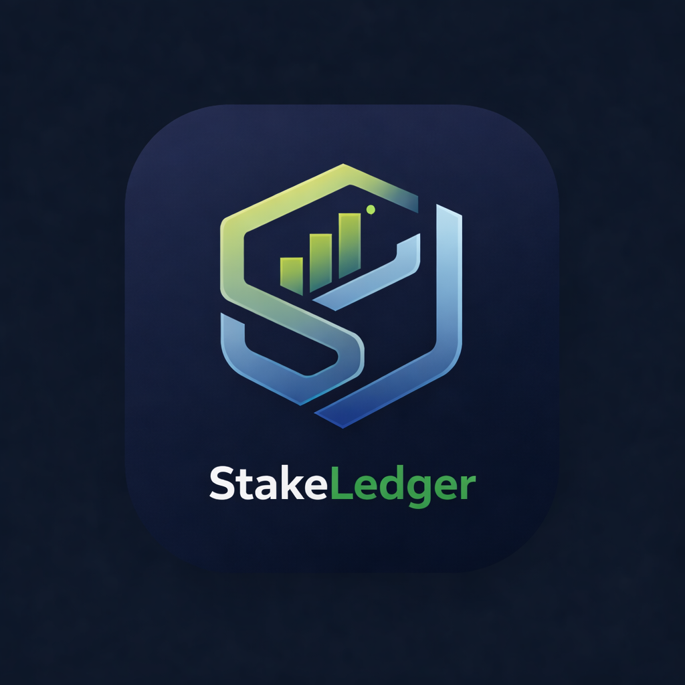

<p align="center">
  
</p>

<h1 align="center">StakeLedger</h1>

<p align="center">
  Gestor de inversion en apuestas con ledger contable, riesgo controlado y analitica accionable.
</p>

---

## Vision del proyecto

StakeLedger nace para darle a los apostadores una fuente unica de verdad: un ledger contable que separa cash, bonus y freebets, normaliza equipos y mercados, y transforma el historial en decisiones racionales. El enfoque combina control de riesgo, trazabilidad total y experiencia de uso rapida, sin perder rigor tecnico.

---

## Progreso por fases

### Que se decidio

- Privacidad por usuario: cada persona ve solo sus propios banks, con roles admin/editor/usuario para control de permisos.
- Modelo contable con 3 bolsillos (cash, bonus, freebet) y saldo operativo visible, manteniendo reglas de riesgo sobre cash disponible.
- Motor de stake 0-20 con cap 40% sobre cash y calculo bidireccional (importe o stake).
- Cashout parcial divide el ticket en dos registros para mantener estadisticas limpias.
- Normalizacion obligatoria de equipos/competiciones con autocompletado y fallback manual marcado.

### Que se definio

- Business Model y Market Context con segmentos, propuesta de valor, posicionamiento y riesgos de mercado.
- PRD completo: problemas, solucion MVP, KPIs y personas objetivo.
- Alcance MVP y criterios de exito definidos con epicas y user stories.
- User journeys para registro, metas dinamicas y feed de recomendaciones.
- SRS completo: requerimientos funcionales y no funcionales, arquitectura C4/ERD y contratos OpenAPI.

### Que falta

- Fase 3: infraestructura base (backend y frontend) para activar el proyecto funcional.
- Fase 4-6: backlog en PBI, planes de prueba y planes de implementacion.
- Fase 7+: implementacion, QA, despliegue y automatizacion.
- Validar en MVP las hipotesis de demanda y monetizacion.

---

## Modulos del sistema

### Modulo 1 - Gestor Integral y Ledger

Motor contable central: multi-bank, bolsillos cash/bonus/freebet, auditoria completa, tickets con legs, cashouts parciales y normalizacion deportiva con fallback manual.

### Modulo 2 - Planificacion Dinamica de Metas

Asesor matematico de metas con recalculo diario, cortafuegos de riesgo y alertas de juego responsable. Ajusta cuota y esfuerzo segun el saldo real y la ruta elegida.

### Modulo 3 - Feed de Sugerencias

Canal de recomendaciones administradas con datos normalizados y adhesion rapida al ledger en dos pasos. Incluye filtros pre-match y live.

### Modulo 4 - Monitor Fiscal

Proyeccion de impacto tributario por jurisdiccion con reserva preventiva sugerida, reportes anuales y disclaimer legal. (Planificado para fases posteriores).

---

## Arquitectura de documentacion

Este repositorio sigue Context Engineering y Spec-Driven Development.

- `.context/` contiene la documentacion que la IA lee para trabajar.
- `.prompts/` contiene los prompts para generar documentacion y guiar cada fase.
- `docs/` incluye blueprints y configuraciones del sistema.

Estructura base:

```
.context/
  idea/        # Fase 1
  PRD/         # Fase 2 (producto)
  SRS/         # Fase 2 (tecnico)
  PBI/         # Fases 4-6
  guidelines/  # Fases 7-14

.prompts/
  fase-1-constitution/
  fase-2-architecture/
  fase-3-infrastructure/
  fase-4-specification/
  ...
```

---

## Documentos clave

- `README.md`
- `.context/idea/business-model.md`
- `.context/idea/market-context.md`
- `.context/PRD/executive-summary.md`
- `.context/PRD/mvp-scope.md`
- `.context/PRD/user-journeys.md`
- `.context/PRD/user-personas.md`
- `.context/SRS/functional-specs.md`
- `.context/SRS/non-functional-specs.md`
- `.context/SRS/architecture-specs.md`
- `.context/SRS/api-contracts.yaml`

---

## Como usar este repo

1. Lee `.context/README.md` para entender el flujo completo.
2. Usa los prompts de `.prompts/` segun la fase.
3. Mantén la trazabilidad: cada avance debe quedar en `.context/`.
