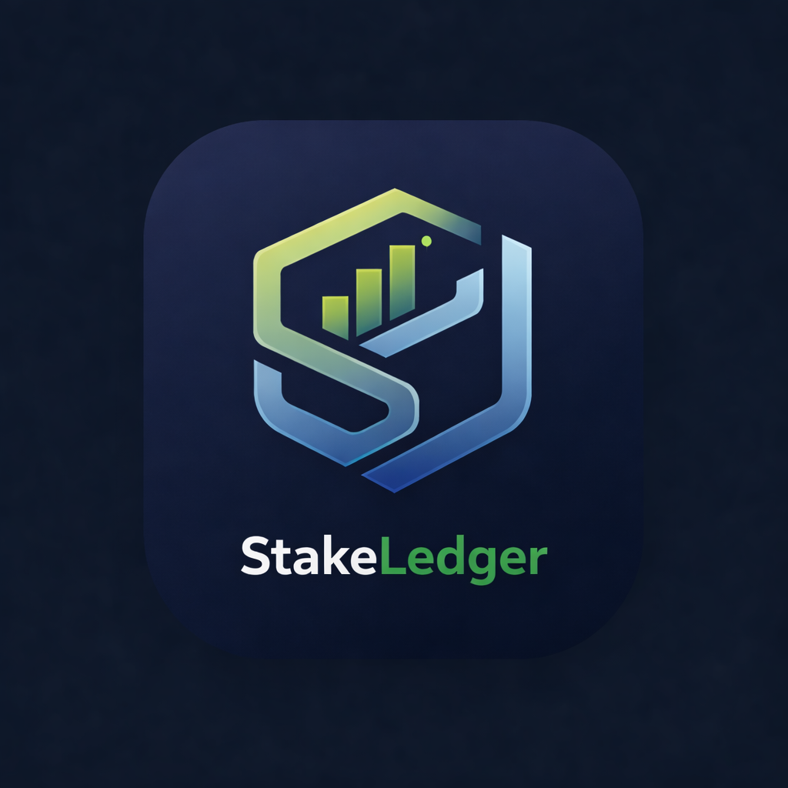

<p align="center">
  
</p>

# StakeLedger

Gestor de inversion en apuestas con ledger contable, riesgo controlado y analitica accionable.

[](https://nextjs.org)
[](https://www.typescriptlang.org)
[](https://supabase.com)
[](https://tailwindcss.com)
[](https://bun.sh)

---

## The Problem

Los apostadores que quieren gestionar su bank con disciplina no tienen una fuente unica de verdad. Mezclan cash, bonus y freebets en notas o historiales incompletos, lo que rompe la trazabilidad y distorsiona el rendimiento real.

| Current Reality                                      | Impact                                              |
| ---------------------------------------------------- | --------------------------------------------------- |
| Mezcla de cash, bonus y freebets sin separacion real | Decisiones basadas en percepcion, no en datos       |
| Falta de normalizacion de equipos, ligas y mercados  | Analitica poco confiable y sin patrones accionables |

## The Solution

StakeLedger provides:

- **Ledger multi-bank con bolsillos** - Cash, bonus y freebet con auditoria completa.
- **Motor de stake y riesgo** - Stake 0-20 con cap 40% sobre cash disponible.
- **Normalizacion deportiva** - Busqueda con autocompletado y fallback manual marcado.
- **Metas dinamicas** - Recalculo diario con cortafuegos de riesgo.
- **Feed de recomendaciones** - Adhesion rapida al registro del usuario.

---

## Tech Stack

| Layer          | Technology                   | Version |
| -------------- | ---------------------------- | ------- |
| **Framework**  | Next.js (App Router)         | 15.5.12 |
| **Runtime**    | Bun                          | 1.3.x   |
| **Language**   | TypeScript                   | 5.9.3   |
| **Backend**    | Supabase (PostgreSQL + Auth) | -       |
| **Styling**    | Tailwind CSS + Radix UI      | 3.x     |
| **Validation** | Zod                          | 4.3.6   |
| **Docs API**   | OpenAPI (zod-to-openapi)     | 8.5.0   |

## Project Structure

```
StakeLedger/
├── src/
│   ├── app/                  # App Router, layouts y rutas
│   │   ├── (minimal)/         # Layout minimo (API docs)
│   │   ├── api/               # API routes (health, openapi, etc.)
│   │   ├── dashboard/         # UI principal
│   │   ├── login/             # Auth UI
│   │   └── signup/            # Auth UI
│   ├── components/
│   │   ├── ui/                # Componentes base (design system)
│   │   └── dashboard/         # Componentes de dominio
│   ├── contexts/              # Providers y contextos
│   ├── lib/                   # Supabase, API helpers, config
│   └── types/                 # Tipos generados
├── docs/                      # Blueprints y guias del sistema
├── scripts/                   # Automatizacion y tooling
├── .context/                  # Context Engineering (specs y guidelines)
└── .prompts/                  # Prompts para fases y documentacion
```

## Database Schema (Simplificado)

```
users
  ├─ banks
  │   ├─ bank_pockets
  │   ├─ transactions
  │   └─ bets
  │       ├─ bet_legs
  │       └─ bet_cashouts
  ├─ goals
  ├─ recommendations
  └─ audit_logs

catalog_teams ─┐
catalog_competitions ─┴─ catalog_aliases
```

---

## Quick Start

### Prerequisites

- [Bun](https://bun.sh) 1.3+
- [Supabase](https://supabase.com) account

### Installation

```bash
# Clone the repository
git clone https://github.com/tu-org/stakeledger
cd stakeledger

# Install dependencies
bun install

# Copy environment variables
cp .env.example .env
```

### Environment Setup

Edit `.env` with your credentials:

```bash
# MCP Builder
MCP_CATALOG_FILE='path-a-tu-catalog.json'
MCP_FILE='path-a-tu-config.json'
AI_COMMAND_PATH=''

# Supabase (Required)
SUPABASE_URL=tu-url-supabase
NEXT_PUBLIC_SUPABASE_ANON_KEY=tu-anon-key
SUPABASE_SERVICE_ROLE_KEY=tu-service-role-key

# Application
NEXT_PUBLIC_APP_URL=http://localhost:3000
```

> Encuentra tus credenciales en Supabase -> Settings -> API.

### Run Development Server

```bash
bun dev
```

Open [http://localhost:3000](http://localhost:3000)

---

## Available Scripts

| Script             | Description                      |
| ------------------ | -------------------------------- |
| `bun dev`          | Inicia el servidor de desarrollo |
| `bun build`        | Genera build de produccion       |
| `bun start`        | Ejecuta build de produccion      |
| `bun typecheck`    | Verifica tipos TypeScript        |
| `bun lint`         | Ejecuta ESLint                   |
| `bun format`       | Formatea codigo con Prettier     |
| `bun run db:types` | Regenera tipos Supabase          |
| `bun run api:sync` | Sincroniza OpenAPI (si aplica)   |

---

## Architecture

### Authentication Flow

```
Usuario -> UI (Next.js)
UI -> API Routes (Next.js)
API -> Supabase Auth
Supabase Auth -> API
API -> UI (session + token)
```

### Security

- **RLS en Supabase** para datos por usuario.
- **RBAC** (admin/editor/user) en rutas protegidas.
- **Validacion estricta** con Zod en endpoints custom.

### Route Groups

| Area | Path                | Description                  |
| ---- | ------------------- | ---------------------------- |
| Auth | `/login`, `/signup` | Flujos de acceso             |
| App  | `/dashboard`        | Vista principal y KPIs       |
| Docs | `/api-docu`         | Documentacion API (solo dev) |
| API  | `/api/*`            | Endpoints custom + OpenAPI   |

---

## Development

### Code Quality

- ESLint (antfu config) + Prettier
- TypeScript strict

```bash
bun lint
bun format:check
bun typecheck
```

### Type Generation

```bash
bun run db:types
```

---

## AI-Driven Development

Este proyecto usa **Context Engineering** para desarrollo asistido por IA.

### Structure

| Directory   | Purpose                                               |
| ----------- | ----------------------------------------------------- |
| `.context/` | Documentacion que la IA lee para entender el proyecto |
| `.prompts/` | Templates para generar documentacion                  |
| `docs/`     | Blueprints y guias del sistema                        |

### Context Loading

La IA carga diferentes contextos segun la tarea:

- **DEV:** `.context/guidelines/DEV/`
- **QA:** `.context/guidelines/QA/`
- **TAE:** `.context/guidelines/TAE/`

Ver `AGENTS.md` para instrucciones detalladas.

---

## Business Model

### Pricing Tiers (Propuesto)

| Feature         | Free     | Pro       |
| --------------- | -------- | --------- |
| Multi-bank      | 1 bank   | Ilimitado |
| Metas dinamicas | Basico   | Avanzado  |
| Analytics       | Limitado | Completo  |

### Target Market

- **Who:** Apostadores disciplinados, analistas de data y tipsters.
- **Where:** Mercados hispanohablantes con cultura de apuestas deportivas.

---

## Roadmap

### Fase 3: Infrastructure (Actual)

- [x] Backend + Supabase setup
- [x] Frontend base + design system
- [x] OpenAPI + API routes base

### Fase 4-6: Specification & PBI

- [ ] User stories, AC y planes de implementacion

### Fase 7+: Implementacion y QA

- [ ] Endpoints de negocio
- [ ] UI funcional MVP
- [ ] QA y despliegue

---

## Contributing

1. Lee la guia de Context Engineering: `.context/context-engineering.md`
2. Sigue los estandares de codigo: `.context/guidelines/DEV/code-standards.md`
3. Usa commits atomicos
4. PR contra `main` (o commit directo si eres unico colaborador)

---

## License

Propietario / All rights reserved

---

## Links

- [Context Engineering Guide](.context/context-engineering.md)
- [Architecture Specs](.context/SRS/architecture-specs.md)
- [Functional Specs](.context/SRS/functional-specs.md)
- [MVP Scope](.context/PRD/mvp-scope.md)
